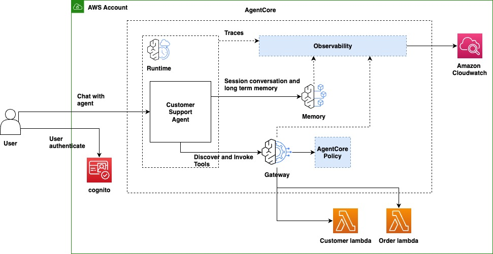
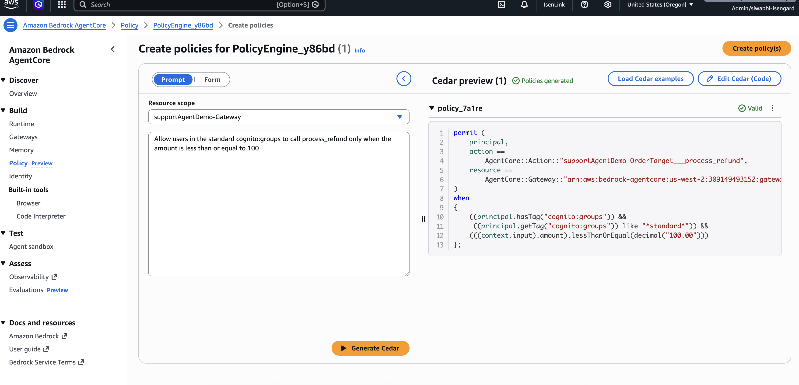

# Amazon Bedrock AgentCore Demo — Customer Support Agent

A production-ready AI customer support agent built on **Amazon Bedrock AgentCore**. This demo walks through deploying an agent, authenticating a user, invoking the agent, and then adding an AgentCore Policy to enforce refund limits in real time.

## Architecture



| Component | Purpose |
|-----------|---------|
| **AgentCore Runtime** | Hosts the containerized Strands agent (Claude Sonnet) with JWT auth |
| **AgentCore Gateway** | MCP-based tool gateway — routes tool calls to Lambda backends |
| **AgentCore Policy Engine** | Evaluates Cedar policies against JWT claims to allow/deny tool calls |
| **AgentCore Memory** | Per-user persistent memory (facts, preferences, summaries, episodes) |
| **Cognito** | User authentication — issues JWTs with `email`, `cognito:groups` claims |
| **Lambda Functions** | Mock customer and order APIs (get/list customers, get/list orders, process refund) |
| **CloudWatch** | Auto-instrumented OpenTelemetry traces for every invocation |

---

## Prerequisites

| Tool | Version | Install |
|------|---------|---------|
| **uv** (Python + packages) | Latest | [Install guide](https://docs.astral.sh/uv/getting-started/installation/). `uv` automatically downloads Python 3.10+ when you run `uv sync`. |
| **Node.js** | 20+ | Install via [nvm](https://github.com/nvm-sh/nvm#installing-and-updating) — `nvm install 20 && nvm use 20` |
| **Docker** | Latest | [Docker Desktop](https://docs.docker.com/desktop/setup/install/mac-install/) or [Finch](https://runfinch.com/docs/getting-started/installation/) |
| **AWS CDK** | v2 | [Install guide](https://docs.aws.amazon.com/cdk/v2/guide/prerequisites.html) |
| **AWS CLI** | v2 | [Install guide](https://docs.aws.amazon.com/cli/latest/userguide/getting-started-install.html) |
| **AgentCore CLI** | Latest | Added to project's dev dependency so automatically installed with `uv sync`, alternatively run `uv pip install bedrock-agentcore-starter-toolkit` |

You will also need **AWS credentials** configured with permissions to your account. This can be accessed via `aws login`, [more details](https://docs.aws.amazon.com/signin/latest/userguide/command-line-sign-in.html). For minimum IAM permissions required, see [AgentCore Starter Toolkit permissions](https://docs.aws.amazon.com/bedrock-agentcore/latest/devguide/runtime-permissions.html#runtime-permissions-starter-toolkit).

---

## Step 1: Deploy the Agent

From the project root, run the deploy script. It installs dependencies, bootstraps CDK, deploys all stacks, and generates the configuration files automatically:

```bash
scripts/deploy.sh
```

> **Note:** The first deploy takes a while — CDK builds a Docker image, pushes it to ECR, and provisions all resources (Runtime, Gateway, Memory, Cognito, Lambdas).

> **Already deployed?** Run `agentcore status` first. If the agent shows `READY` or `ACTIVE`, skip to Step 2.

This deploys:
- **AgentCore Runtime** — containerized agent running Claude Sonnet 4.5
- **AgentCore Gateway** — MCP-based tool gateway with JWT authorization
- **AgentCore Memory** — persistent memory scoped per user
- **Cognito User Pool** — user authentication
- **Lambda Functions** — backend APIs for customer/order data

Verify it's running:

```bash
agentcore status
```

---

## Step 2: Create a User and Get a Bearer Token

The demo uses Amazon Cognito for authentication.

### Create a user

```bash
uv run scripts/cognito-user.py --create
```

The script prompts you for an email and password. Use an email that matches one of the backend's mock customers so the agent can look up your orders:

| Name | Email |
|------|-------|
| John Doe | `john@example.com` |
| Jane Smith | `jane@example.com` |

This creates the user in the Cognito user pool and assigns them to the `standard` group. You'll use the password you chose when logging in via the browser.

### Log in and get a token

```bash
eval $(uv run scripts/cognito-user.py --login --export)
```

This opens your browser for a Cognito login, then sets the bearer token as an environment variable (`BEDROCK_AGENTCORE_BEARER_TOKEN`).

---

## Step 3: Invoke the Agent

With your token set, invoke the agent:

```bash
agentcore invoke '{"prompt": "Who am I?"}'
```

The agent identifies you from the JWT token — your email, group, and permissions. No API keys or service accounts. Real user identity flows end-to-end.

Now try fetching orders and processing a refund:

```bash
agentcore invoke '{"prompt": "Show me my recent orders"}'
```

```bash
agentcore invoke '{"prompt": "I need a refund for order ORD-12420. The phone case was damaged."}'
```

The refund succeeds. At this point there is **no policy restricting** the refund amount — the agent can process any amount.

---

## Step 4: Request a Large Refund (No Policy Yet)

Try a large refund to establish a baseline:

```bash
agentcore invoke '{"prompt": "I need a refund of $399 for order ORD-12430. The monitor has dead pixels."}'
```

The refund goes through because no Cedar policy is in place to block it. The agent has unrestricted access to the `process_refund` tool.

---

## Step 5: Add AgentCore Policies

Now add policies to control which tools the agent can call and under what conditions. AgentCore policies are enforced at the **Gateway layer** — outside the AI model — so the agent cannot bypass them.

### 5a. Create a Policy Engine

1. Open the **AWS Console**(confirm region) > **Amazon Bedrock** > **AgentCore** > **Policy Engine**, click **Create policy engine**
2. Click Add policies, select supportAgentDemo gateway in resource scope dropdown.


### 5b. Add Policy 1 — Allow all tools except `process_refund`

This policy permits all read-only tools for any authenticated user:

Type in prompt "Allow all authenticated users to call get_customer, list_customers, get_order, and list_orders" > Click Generate Cedar > Create policy

### 5c. Add Policy 2 — Restrict `process_refund` by group and amount

This policy allows the `standard` group to call `process_refund` only when the refund amount is $100 or less:

Type in prompt "Allow users in the standard cognito:groups to call process_refund only when the amount is less than or equal to 100" > Click Generate Cedar > Create policy



### 5d. Enable the Policy Engine

After adding both policies, **associate** the policy engine to supportAgentDemo gateway. Policies take effect immediately — no redeployment needed.


### How it works

```
User Request → AgentCore Runtime → AgentCore Gateway → Cedar Policy Engine → Backend
                                         ↑
                                   Evaluates JWT claims
                                   (cognito:groups) against
                                   Cedar policies
```

1. User authenticates via Cognito and gets a JWT with `cognito:groups` claim
2. Agent calls a tool through the Gateway
3. Gateway sends user claims + request context to the Policy Engine
4. Policy Engine evaluates Cedar policies and returns allow/deny
5. If denied, the Gateway blocks the tool call before it reaches the backend

---

## Step 6: Invoke Again — Policy Blocks the Refund

Try the same large refund again:

```bash
agentcore invoke '{"prompt": "I need a full refund for order ORD-12300. The shoes dont fit."}'
```

This time the refund is **blocked** by the AgentCore policy. The agent receives a policy violation from the Gateway and informs the user.

The key takeaway: the agent can be jailbroken, the model can hallucinate, but the policy layer doesn't care — it enforces rules regardless. The security boundary is in the infrastructure, not in the AI.

---

## Troubleshooting

| Problem | Solution |
|---------|----------|
| `agentcore: command not found` | Run `uv pip install bedrock-agentcore-starter-toolkit` |
| Token script fails to open browser | Copy the URL from terminal output and open manually |
| "Unauthorized" when invoking | Token expired (1 hour). Re-run `eval $(uv run scripts/cognito-user.py --login --export)` |
| CDK deploy fails | Ensure Docker is running. Check credentials: `aws sts get-caller-identity` |
| `node -v` shows version < 20 | Install Node 20+: `nvm install 20 && nvm use 20` |
| Port 3000 in use (token script) | Kill the process: `lsof -ti:3000 \| xargs kill` |

---

## Footnotes

### Checking Traces (Observability)

Every agent invocation is instrumented with OpenTelemetry out of the box. To inspect traces:

1. Open the **AWS Console** in `us-west-2` or appropriate region where agent is deployed
2. Navigate to **CloudWatch** > **GenAI Observability** > **Bedrock AgentCore**
3. In All Sessions tab, filter by session ID matching your invocations

Each trace shows:
- **Full request lifecycle** — from initial request through to response
- **Tool calls** — every call the agent made through the Gateway (e.g., `list_orders`, `process_refund`)
- **Policy evaluations** — whether the Policy Engine allowed or denied each tool call
- **Memory operations** — retrieval and storage of user preferences/facts
- **Model inference** — latency, token counts, model ID

This is useful for debugging policy denials. After Step 6, look for the `process_refund` tool call trace — you'll see the Gateway's policy evaluation returning a deny decision with the Cedar policy that blocked it.

No custom logging code is required. AgentCore instruments all of this automatically via the OpenTelemetry distro bundled in the container image (`aws-opentelemetry-distro`).

### Session IDs

By default, each `agentcore invoke` call generates a new session. To start a named session, pass a session ID with the `-s` flag once — the AgentCore CLI remembers it for subsequent invocations:

```bash
agentcore invoke -s $(uuidgen) '{"prompt": "Show me my recent orders"}'

# Subsequent calls automatically use the same session
agentcore invoke '{"prompt": "Refund the headphones"}'
```

The agent runtime and memory (preferences, facts, session summaries) is scoped per session and user. Using the same session lets the agent reference earlier parts of the conversation.

### Cleanup

To destroy all deployed resources and remove generated config files:

```bash
scripts/teardown.sh
```

This runs `cdk destroy` on all stacks and removes `cdk-outputs.json` and `.bedrock_agentcore.yaml`.
